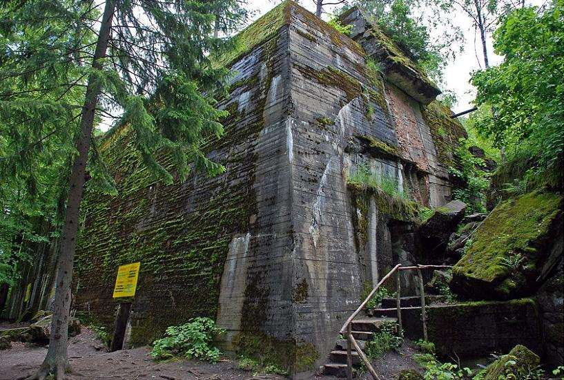
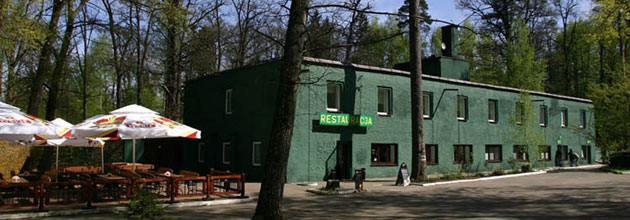
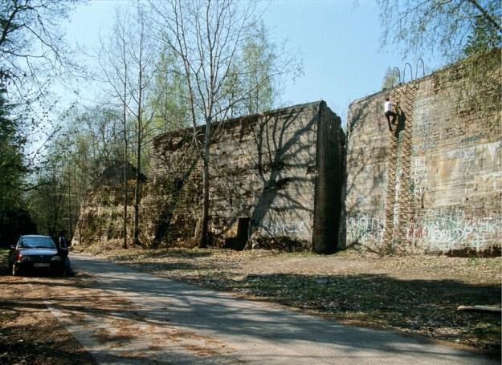

# Wilczy Szaniec

Kwatera Hitlera w Gierłoży.

To tu Hitler spędził 800 dni w czasie wojny. Bunier o stropie grubości 7 metrów, 
był w stanie wytrzymać uderzenie 5 tonowych bomb. Wewnątrz kominek, pokoje gościnne,
sypialnia, pokój narad. Cały obiekt mial ponad 500metrów kwadratowych powierzchni.
Piwnica 350 metrów kwadratowych, pełna żywności, amunicji, masek gazowych. 
Na szczycie działa przeciwlotnicze i karabiny maszynowe broniły otoczenia bunkra.
Ostatecznie został zniszczony przez Niemców w 1945 roku.

Tanie noclegi w historycznym hotelu znajdującym się w 2 strefie kwatery.
[Dziś nocleg zamowić możesz korzystając z tej strony](http://wolfsschanze.pl/ "Tytuł")
Od 1942 do 1945 roku to tu zatrzymywali się średni rangą oficerowie Wermachtu i SS.

Na terenie znajdują się inne ciężkie schrony. 
Jednym z nich jest podwójny schron wojsk lądowych i marynarki wojennej.
Dla dreszczyku emocji śmiałkowie wspinają sie czasem na szyt umocnień.

W okolicy warto zobaczyć jeszcze;
<ol>
<li>Kwaterę Wojsk Lądowych (OKH)</li>
<li>Kwatere Himlera</li>
<li>Kanał Mazurski</li>
<li>Twierdzę Bojen</li>
<li>Świętą Lipkę<li/li>
#*Okolica Kwatery Hitlera*

Dziewiętnaście kilometrów od siedziby Hitlera znajduje sie kwatera Wojsk Lądowych(OKH).
To tu znajduje się największy kompleks niezniszczonych bunkrów.
Największy z nich to bunkier Kwatermistrza Webera i schron zwany gigantem.
20 kilometrów dalej znajdują się także Kwatera Himlera w Pozezdrzu, 
oraz śluza Leśniewo będąca elementem niedokończonego KanaŁu Mazurskiego.
[Najciekawsze zdjecia obejrzeć możesz tutaj.](https://www.google.pl/search?q=mamerki&biw=1127&bih=588&tbm=isch&imgil=jmcxDgDIe5TFNM%253A%253BSYFTjyyEmyisoM%253Bhttp%25253A%25252F%25252Fmazury.info.pl%25252Fatrakcje%25252Fmamerki%25252F&source=iu&pf=m&fir=jmcxDgDIe5TFNM%253A%252CSYFTjyyEmyisoM%252C_&usg=__mLqd9_wVclRRaZ0Fm3VHNy8vfiA%3D&dpr=1&ved=0ahUKEwiH4t_ij9DMAhVD_iwKHYaXC4EQyjcILA&ei=hiYyV4eHF8P8swGGr66ICA#imgrc=jmcxDgDIe5TFNM%3A)

-Jeśli checie Państwo odwiedzić okolicę polecam wycieczkę z przewodnikiem Marcinem Puciato.-
Możliwe jest zwiedzanie w języku Polskim i Angielskim, nr kontaktowy to 500 799 154.

